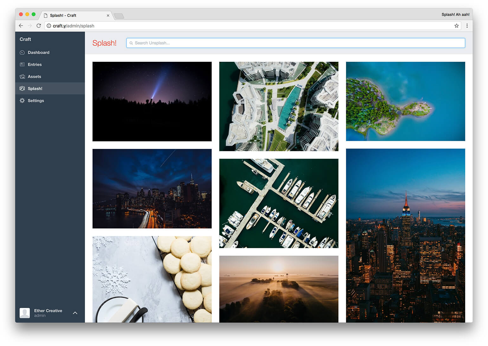
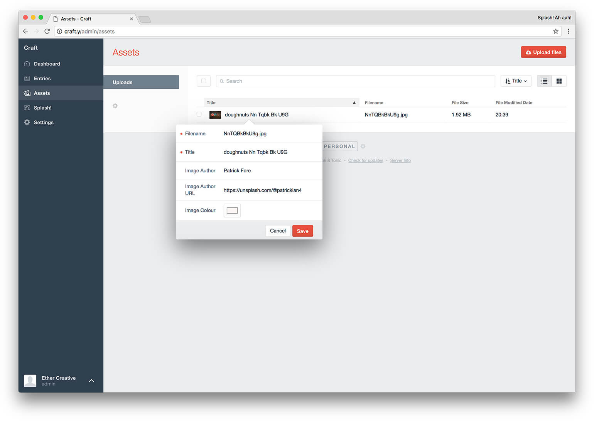

# Splash!
Quickly and easily get beautiful Unsplash images in Craft!

[Click here for the **Craft 2.5** version.](https://github.com/ethercreative/splash/tree/v2)

### Features
- Quick and easy search & preview
- Store the images author and a link to their Unsplash profile
- Save the complementary colour of the image, as chosen by Unsplash
- Stop clients uploading bad images ever again! (Just kidding, of course they will)

## Upcoming Features

- [ ] Search Collections
- [ ] Keep track of previously downloaded images
- [ ] Integrate with additional free stock image services
- [ ] Ability to like and collect images, mood boards?
- [ ] Improve asset titles on download